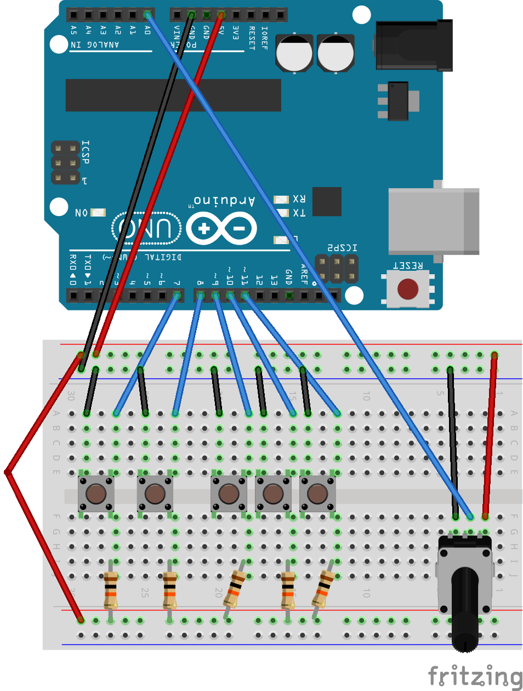

# Arduino Spotify Controller
An arduino HID controller for Spotify via the Spotify Web API.

# Contents
* <b>/.idea</b> - Contains project information for IntelliJ
* <b>/arduino</b> - Contains .ino file to run on Arduino
* <b>/src</b> - Contains Java files
* <b>/target/classes</b> - Contains information on Java classes for compiler
* <b>/pom.xml</b> - Maven dependencies
* <b>/schem.png</b> - Breadboard diagram of circuit

# Installation/Usage
Keep in mind that this project was strictly intended for my own personal use - it is not designed with user-friendliness in mind whatsoever. The code must be manually edited and compiled in order to be used.
## Arduino
Building this project requires:

* Arduino UNO
* Breadboard
* 5x pushbutton
* 5x 10k ohm resistor
* 1x potentiometer
* 1x 16x2 LCD screen with I2C shield (preferably [this one](https://www.amazon.ca/gp/product/B019K5X53O/ref=ppx_yo_dt_b_asin_title_o03_s00?ie=UTF8&psc=1))
* Some male-to-male and male-to-female jumper wires

The schematic is as shown:

You may notice that the LCD screen is missing - this is due to Fritzing not including the LCD with shield that I used when originally building this project.

Assuming you have the same LCD as linked above, connecting the LCD screen is relatively simple:
* GND on LCD -> GND on Arduino
* VCC on LCD -> 5V on Arduino
* SDA on LCD -> SDA on Arduino
* SCL on LCD -> SCL on Arduino

If you are attempting to build this with a different LCD screen/shield, you may have to use different pins or alter the arduino code. See the [hd44780 library](https://www.arduino.cc/reference/en/libraries/hd44780/) for more details.

## Authorization
In order for the program to control your Spotify account, it must be provided with an access token. This program does not contain a built-in authorization flow to obtain a token for you - you must obtain this token manually.

The easiest way to do this is to go to [this link](https://developer.spotify.com/console/get-album-tracks/), select GET TOKEN, check all of the boxes, and finally click REQUEST TOKEN. You should be redirected to the same page. The string that appears next to the GET TOKEN button is your access token.

This token must be manually placed in InputListener.java on line 19: `static String access_token = "`\[your token here\]`";`

Keep in mind that this access token only lasts one hour - once it has expired, you must obtain a new one and restart the program.

## Running the Program
Setting this up requires the [Arduino IDE](https://www.arduino.cc/en/software) and a Java IDE. I would recommend using [IntelliJ IDEA](https://www.jetbrains.com/idea/) in a Maven project, as this is what was used during development.

First, upload the Arduino sketch to the arduino, and then run InputListener.java. Once you see "Started" in the Java output, it should be ready for use.

##  Notes/Known Issues

Any song titles/artists with non-UTF-8 characters will not be displayed properly. This includes any non-english language characters and non-standard symbols. This is due to limitations with both sending serial data to Arduino and the LCD display itself. The display should fix itself upon switching to a new track that can be read properly.

# Credits/Thanks
* [jSerialComm](https://fazecast.github.io/jSerialComm/) Java library, extremely useful for sending/recieving data over serial

* [hd44780](https://www.arduino.cc/reference/en/libraries/hd44780/) Arduino library, extremely useful for using the LCD screen
